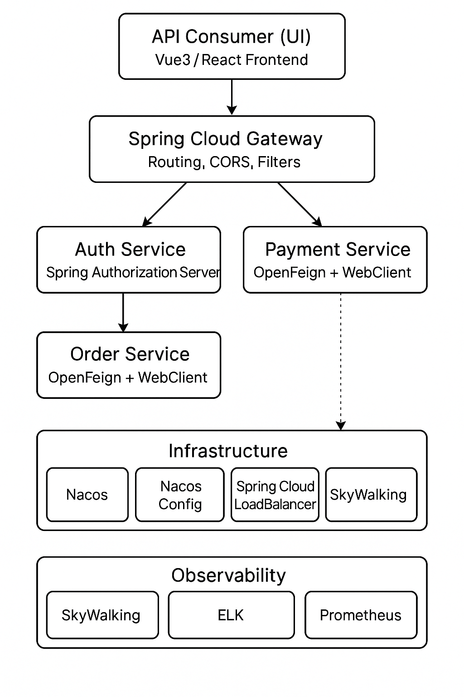

# xksms-cloud

#### 介绍
{**以下是 Gitee 平台说明，您可以替换此简介**
Gitee 是 OSCHINA 推出的基于 Git 的代码托管平台（同时支持 SVN）。专为开发者提供稳定、高效、安全的云端软件开发协作平台
无论是个人、团队、或是企业，都能够用 Gitee 实现代码托管、项目管理、协作开发。企业项目请看 [https://gitee.com/enterprises](https://gitee.com/enterprises)}

## 🧱 微服务架构选型总览

### ✅ 🔧 微服务基础架构能力选型清单

| 🧩 能力              | 🔨 选型                         | 💬 简要评价                                                             |
|--------------------|-------------------------------|---------------------------------------------------------------------|
| **服务注册中心**         | **Nacos**                     | Spring Cloud Alibaba 官方主推，支持服务注册 + 配置管理一体化                          |
| **配置中心**           | **Nacos Config**              | 与注册中心共用 Nacos，方便管理与热更新                                              |
| **服务通信**           | **OpenFeign + WebClient**     | Feign 用于服务间同步通信，WebClient 用于调用第三方或异步流式请求，互补组合                       |
| **服务治理（负载均衡）**     | **Spring Cloud LoadBalancer** | Ribbon 已废弃，LoadBalancer 是 Spring Cloud 官方替代方案，默认集成于 Feign/WebClient |
| **服务限流 / 熔断 / 降级** | **Sentinel**                  | 阿里官方组件，功能全，支持接口级与网关级限流，控制台完善，适配 Spring Cloud Alibaba                |
| **网关层**            | **Spring Cloud Gateway**      | 原生响应式网关，功能强大，支持路径路由、权限拦截、限流、Filter 扩展等                              |

---

### 📊 🔍 可观测性体系

| 📈 能力       | 技术选型                                       | 💡 简要说明                                            |
|-------------|--------------------------------------------|----------------------------------------------------|
| **链路追踪**    | **SkyWalking**                             | 自动采集服务间调用链路、耗时、异常位置，适配 Spring Boot 3 和多语言服务        |
| **日志采集与分析** | **ELK（Elasticsearch + Logstash + Kibana）** | 多服务统一日志采集、结构化处理、全文检索与可视化分析                         |
| **指标监控**    | **Prometheus + Grafana**                   | 主动采集服务运行指标（如 JVM、接口、数据库、Redis 等），并通过 Grafana 可视化展示 |
| **告警通知**    | **Prometheus + AlertManager**              | 基于监控指标设置精细化告警规则，支持钉钉、飞书、邮件、短信等多种推送方式               |

---

### 🛡 通用基础能力

| 能力         | 技术选型                                       | 推荐理由                                        |
|------------|--------------------------------------------|---------------------------------------------|
| **鉴权认证**   | **Spring Authorization Server（标准 OAuth2）** | OAuth2 适合构建统一认证中心，支持 SSO 和多端接入              |
| **API 文档** | **Springdoc OpenAPI + Knife4j**            | Spring Boot 3.x 官方推荐，UI 强大，支持接口调试与分组        |
| **国际化支持**  | **Spring MessageSource**                   | 支持语言资源文件，适配不同国家用户需求                         |
| **多租户支持**  | **MyBatis + 动态数据源 / 表字段隔离 / 表名改写**         | 适合 SaaS 场景，支持库/表/字段级租户隔离                    |
| **分布式事务**  | **Seata**                                  | 支持 AT、TCC、SAGA 多种模式，适配 Spring Cloud 和 Nacos |

---

### 🚀 开发效率支持体系选型清单

| 🛠 能力          | 技术选型                                    | 推荐理由                                       |
|----------------|-----------------------------------------|--------------------------------------------|
| **模块封装能力**     | **自定义 Spring Boot Starter（日志、RPC、监控等）** | 提升通用能力复用率，统一规范、便于维护                        |
| **持续集成 CI/CD** | **Jenkins**                             | Jenkins 功能强大，适合复杂构建场景                      |
| **容器化部署**      | **Docker Compose**                      | 适合本地联调与测试环境部署，启动快速，配置简单                    |
| **数据库版本管理**    | **Flyway（轻量级）**                         | Flyway 推荐用于主流 Spring Boot 项目，简单易用，SQL 驱动清晰 |

---

### 🔗 前后端交互支持体系选型清单

| 分类         | 技术栈                                 | 📌 说明                     |
|------------|-------------------------------------|---------------------------|
| **前端框架**   | Vue3 + Element Plus / React         | 与后端 API 接口统一协作，适配主流前端开发生态 |
| **跨域处理**   | CORS 全局配置 / Gateway 层统一设置           | 前后端分离部署常见，建议统一通过网关进行跨域控制  |
| **统一响应模型** | 自定义 `ResponseResult<T>` 封装 + 全局异常处理 | 保证接口响应结构一致，便于前端统一解析与错误处理  |

---


#### 项目结构

```
xksms-cloud
├── pom.xml                                 # 多模块聚合父项目（继承 Spring Boot 官方父级）
│
├── xksms-dependencies                      # ✅ 依赖版本管理 BOM（dependencyManagement + import）
│
├── xksms-common                            # 公共工具模块（BeanUtils、枚举、基础对象）
├── xksms-commons-core                      # 全局响应结构、异常类、错误码、基础枚举等
├── xksms-commons-security                  # 用户上下文、JWT 工具类、安全注解
│
├── xksms-starters                          # 通用 Starter 封装集合
│   ├── xksms-starter-log                   # MDC、TraceId 日志增强
│   ├── xksms-starter-elk                   # ELK JSON 格式日志适配（logstash-logback-encoder）
│   ├── xksms-starter-rpc                   # OpenFeign 封装：拦截器 + fallback + 日志
│   ├── xksms-starter-webclient             # WebClient 拦截器链 + 超时配置
│   ├── xksms-starter-error                 # 全局异常处理 + 自定义错误码解析
│   ├── xksms-starter-security              # JWT 解析 + 用户信息注入 + 权限注解支持
│   ├── xksms-starter-swagger               # SpringDoc + Knife4j 文档配置
│   ├── xksms-starter-datasource            # 动态数据源 + 分库分表 + 多租户 + ShardingSphere
│   ├── xksms-starter-cache                 # Redis + Caffeine 本地二级缓存封装
│   ├── xksms-starter-job                   # XXL-Job 注册 + 注解支持
│   ├── xksms-starter-i18n                  # 国际化 MessageSource 封装
│   ├── xksms-starter-observability         # SkyWalking、Prometheus、Micrometer 集成
│   ├── xksms-starter-cors                  # 全局 CORS 支持
│   ├── xksms-starter-idempotent            # 接口幂等性控制（Redis + 注解）
│   ├── xksms-starter-tenant                # 多租户上下文、租户隔离插件
│   ├── xksms-starter-seata                 # Seata 客户端封装（数据源代理）
│   └── xksms-starter-test                  # TestContainer、WireMock 集成测试支持
│
├── xksms-config
│   ├── xksms-config-server                 # 配置中心（Nacos / Spring Cloud Config）
│   └── xksms-config-repo                   # 配置仓库（nacos 配置 / Git）
│
├── xksms-gateway
│   ├── xksms-gateway-core                  # 基础网关配置、全局异常、鉴权过滤器
│   └── xksms-gateway-ratelimit             # Sentinel、Redis、Bucket4j 限流策略
│
├── xksms-auth
│   ├── xksms-auth-server                   # OAuth2 授权服务（Spring Authorization Server）
│   └── xksms-auth-client                   # 鉴权接口，供网关解析 JWT 与获取用户信息
│
├── xksms-log-center
│   └── log-consumer                        # Kafka/Filebeat 日志消费入库模块
│
├── xksms-monitor
│   ├── xksms-monitor-admin                 # Spring Boot Admin 服务监控
│   ├── xksms-monitor-tracing               # SkyWalking 采集 Agent 服务
│   └── xksms-monitor-metrics               # Prometheus 指标采集 + Grafana 面板模板
│
├── xksms-job
│   ├── xksms-job-admin                     # XXL-Job 管理控制台
│   └── xksms-job-client                    # Job 执行器模块（调用 starter-job）
│
├── xksms-notify
│   ├── xksms-notify-core                   # 通知接口定义 + 通道管理
│   └── xksms-notify-adapter                # 短信、邮箱、钉钉、微信适配器
│
├── xksms-file
│   └── xksms-file-service                  # 文件上传模块（本地、OSS、MinIO 等）
│
├── xksms-search
│   └── xksms-search-service                # Elasticsearch 统一全文检索（商品、日志等）
│
├── xksms-tenant
│   └── xksms-tenant-service                # 多租户服务模块（租户初始化、配置、隔离）
│
├── xksms-ai
│   └── xksms-ai-core                       # AI 能力平台（对接大模型，Prompt 管理等）
│
├── xksms-admin
│   ├── xksms-admin-api                     # 管理后台后端接口聚合层（聚合网关 + 业务 BFF）
│   └── xksms-admin-ui                      # 管理后台前端（Vue3 + Element Plus）
│
├── xksms-docs
│   └── 架构图、模块设计、接口规范、部署文档等（Markdown / AsciiDoc / PlantUML）
│
├── xksms-test
│   └── 集成测试场景、Contract Test、性能压测用例等
│
├── xksms-modules                          # 🧠 各领域核心业务模块（强烈建议 api + biz 分层）
│   ├── xksms-user
│   │   ├── xksms-user-api                 # DTO + FeignClient + 通用常量
│   │   └── xksms-user-biz                 # Controller + Service + Mapper
│   ├── xksms-order
│   │   ├── xksms-order-api
│   │   └── xksms-order-biz
│   ├── xksms-product
│   │   ├── xksms-product-api
│   │   └── xksms-product-biz
│   ├── xksms-payment
│   │   ├── xksms-payment-api
│   │   └── xksms-payment-biz
│   └── ...
```
#####         
#### 安装教程

1.  xxxx
2.  xxxx
3.  xxxx

#### 使用说明

1.  xxxx
2.  xxxx
3.  xxxx

#### 参与贡献

1.  Fork 本仓库
2.  新建 Feat_xxx 分支
3.  提交代码
4.  新建 Pull Request


#### 特技

1.  使用 Readme\_XXX.md 来支持不同的语言，例如 Readme\_en.md, Readme\_zh.md
2.  Gitee 官方博客 [blog.gitee.com](https://blog.gitee.com)
3.  你可以 [https://gitee.com/explore](https://gitee.com/explore) 这个地址来了解 Gitee 上的优秀开源项目
4.  [GVP](https://gitee.com/gvp) 全称是 Gitee 最有价值开源项目，是综合评定出的优秀开源项目
5.  Gitee 官方提供的使用手册 [https://gitee.com/help](https://gitee.com/help)
6.  Gitee 封面人物是一档用来展示 Gitee 会员风采的栏目 [https://gitee.com/gitee-stars/](https://gitee.com/gitee-stars/)
